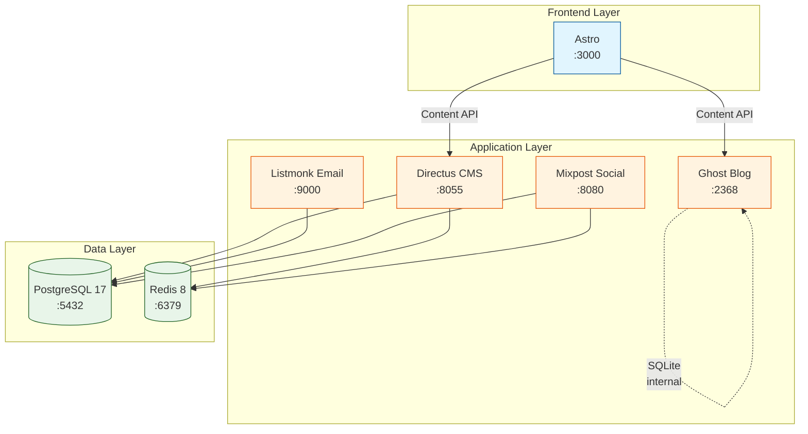

# WV Wild Outdoors Storefront

Digital ecosystem for WV Wild Outdoors LLC - a family-owned sporting goods store in Birch River, West Virginia.

## Tech Stack

| Service | Purpose | Production URL |
|---------|---------|----------------|
| Astro | Static storefront | wvwildoutdoors.com |
| Directus | Product CMS | admin.wvwildoutdoors.com |
| Ghost | Blog (SQLite) | blog.wvwildoutdoors.com |
| Listmonk | Newsletter | mail.wvwildoutdoors.com |
| Umami | Analytics | analytics.wvwildoutdoors.com |

## Architecture



**Service Dependencies:**
- **Data Layer**: PostgreSQL and Redis start first (no dependencies)
- **Application Layer**: Directus and Listmonk use PostgreSQL; Ghost uses internal SQLite
- **Frontend Layer**: Astro depends on Directus and Ghost Content APIs

> **Note**: Astro and Mixpost are currently disabled in docker-compose.yml. See [quickstart.md](specs/001-docker-dev-stack/quickstart.md) for details.

## Quick Start (Local Development)

> **Developer Infrastructure**: This local development stack is Matt's responsibility. Kim accesses production admin panels only (Directus CMS, Ghost editor). Per Constitutional Principle IV: If it requires a terminal, it's Matt's domain.

**Prerequisites**: Docker Desktop (Windows/macOS) or Docker Engine + Docker Compose (Linux)

```bash
# Copy environment template
cp .env.example .env
# Edit .env with generated secrets (see .env.example for instructions)

# Start all services
./scripts/dev-start.sh       # Unix/macOS/Linux
./scripts/dev-start.ps1      # Windows PowerShell

# Or use Docker Compose directly
docker compose up -d
```

**Access Services:**
- **Astro Frontend**: http://localhost:3000
- **Directus CMS**: http://localhost:8055
- **Ghost Blog**: http://localhost:2368
- **Listmonk Email**: http://localhost:9000
- **Mixpost Social**: http://localhost:8080
- **PostgreSQL**: localhost:5432
- **Redis**: localhost:6379

**Other Commands:**
```bash
# Stop services (keep data)
./scripts/dev-stop.sh

# Clean environment (remove all data)
./scripts/dev-clean.sh

# Load seed data (15 WV-themed products)
./scripts/dev-seed.sh

# View logs
./scripts/dev-logs.sh [service-name]

# View status
./scripts/dev-status.sh

# Restart a service
./scripts/dev-restart.sh [service-name]

# Rebuild a service
./scripts/dev-rebuild.sh [service-name]
```

**Complete Documentation:**
- [Quickstart Guide](specs/001-docker-dev-stack/quickstart.md) - Detailed setup, troubleshooting, daily workflow
- [Spec & Architecture](specs/001-docker-dev-stack/) - Full technical specifications

## Documentation

- [Complete Blueprint](docs/BLUEPRINT.md)
- [Directus Schema](directus-schema/schema.json)
- [Seed Data](directus-schema/seed-data.json)

## Project Status

- [x] Schema design (8 collections)
- [x] Seed data
- [x] Docker infrastructure
- [ ] Astro storefront
- [ ] Ghost theme
- [ ] Production deployment

---

*Private project for WV Wild Outdoors LLC*
