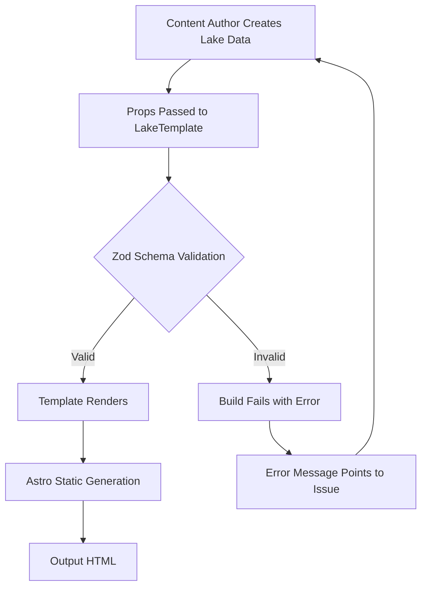

# Architecture Document: Lake Template Component System

**Feature**: SPEC-13 Lake Template
**Created**: 2025-12-29
**Status**: Architecture Design Phase
**Target**: `wv-wild-web/src/components/templates/LakeTemplate.astro` (~600 lines)

---

## Table of Contents

1. [System Overview](#1-system-overview)
2. [Component Composition Strategy](#2-component-composition-strategy)
3. [Type System Architecture](#3-type-system-architecture)
4. [Custom Section Specifications](#4-custom-section-specifications)
5. [File Organization](#5-file-organization)
6. [WVWO Compliance Architecture](#6-wvwo-compliance-architecture)
7. [Responsive Layout Architecture](#7-responsive-layout-architecture)
8. [Testing Architecture](#8-testing-architecture)
9. [Build Process and Validation](#9-build-process-and-validation)
10. [Implementation Readiness](#10-implementation-readiness)

---

## 1. System Overview

### 1.1 Purpose

The Lake Template Component System provides a **reusable, type-safe Astro template** for creating comprehensive West Virginia lake recreation pages with:
- **Fishing-centric content organization** (primary focus)
- Marina and boat access details
- Camping facility information
- Seasonal activity guides
- Safety regulations and compliance
- 100% WVWO brand consistency

### 1.2 Architecture Philosophy

**Component Composition over Duplication**
- Leverage existing SPEC-11 adventure components (70%+ reuse target)
- Create custom sections only where existing components don't fit
- Single source of truth for type definitions
- Build-time validation with Zod schemas
- Zero runtime overhead

**Design Principles**
1. **Type Safety First**: All props validated at build time
2. **Accessibility by Default**: WCAG 2.1 AA compliance in all sections
3. **Performance Optimized**: Static generation, minimal JavaScript
4. **Brand Consistent**: WVWO aesthetic enforced architecturally
5. **Mobile-First Responsive**: Progressive enhancement from mobile to desktop

### 1.3 Target Metrics

| Metric | Target | Validation Method |
|--------|--------|-------------------|
| Template Size | ~600 lines | Line count with comments |
| Component Reuse | 70%+ | Count of existing vs new sections |
| Type Coverage | 100% | TypeScript strict mode compilation |
| WVWO Compliance | 100% | Automated tests (no rounded-md/lg/xl) |
| Accessibility | 95+ score | Lighthouse audit |
| Performance | 90+ score | Lighthouse audit |
| Build Validation | 0 errors | Zod schema parse success |

---

## 2. Component Composition Strategy

### 2.1 Existing Component Usage (SPEC-11 Bundle)

The template leverages **10 existing adventure components** for maximum consistency:

```typescript
// Component imports (existing)
import AdventureQuickStats from '../adventure/AdventureQuickStats.astro';
import AdventureWhatToFish from '../adventure/AdventureWhatToFish.astro';
import AdventureFeatureSection from '../adventure/AdventureFeatureSection.astro';
import AdventureCampingList from '../adventure/AdventureCampingList.astro';
import AdventureAmenitiesGrid from '../adventure/AdventureAmenitiesGrid.astro';
import AdventureGearChecklist from '../adventure/AdventureGearChecklist.astro';
import AdventureGettingThere from '../adventure/AdventureGettingThere.astro';
import AdventureRelatedShop from '../adventure/AdventureRelatedShop.astro';
import AdventureCTA from '../adventure/AdventureCTA.astro';
import Layout from '../../layouts/Layout.astro';
```

**Reuse Pattern**:
```astro
<!-- Hero Section -->
<section class="relative h-[70vh] min-h-[500px]">
  <!-- Custom hero implementation -->
</section>

<!-- Quick Stats (EXISTING COMPONENT) -->
<AdventureQuickStats
  stats={[
    { value: acreage.toLocaleString(), label: 'Acres', icon: 'area' },
    { value: `${maxDepth} ft`, label: 'Max Depth', icon: 'info' },
    { value: county, label: 'County', icon: 'location' }
  ]}
  variant="white"
/>

<!-- What to Fish (EXISTING COMPONENT) -->
<AdventureWhatToFish
  features={fishSpecies}
  title="What to Fish"
  variant="cream"
  columns={2}
  accentColor="sign-green"
/>
```

### 2.2 Custom Sections Architecture (6 new sections)

**NEW sections requiring custom implementation**:

| Section | Lines | Purpose | Complexity |
|---------|-------|---------|------------|
| Hero | ~50 | Hero image + stats overlay + badges | Medium |
| Where to Fish | ~80 | Fishing spots with depth/structure | High |
| Marina | ~100 | Services, launch, rentals, contact | High |
| Activities | ~60 | Recreation beyond fishing | Medium |
| Seasonal Guide | ~80 | Season-by-season breakdown | Medium |
| Safety & Regs | ~70 | Rules by category with orange accent | Medium |

**Total custom code**: ~440 lines + component usage = **~600 line target**

### 2.3 Component Dependency Hierarchy

```
LakeTemplate.astro (root)
├── Layout.astro (wrapper)
│
├── Hero Section (CUSTOM)
│   ├── Hero image with overlay
│   ├── Stats grid (4 columns → 2 mobile)
│   └── Quick highlights badges
│
├── AdventureQuickStats ✅ (EXISTING)
│   └── Horizontal stats bar
│
├── AdventureWhatToFish ✅ (EXISTING)
│   └── AdventureFeatureSection ✅ (base)
│       └── 2-column grid with green accents
│
├── Where to Fish (CUSTOM)
│   └── Full-width spot cards
│       ├── Depth + structure info
│       ├── Species badges
│       └── Access details
│
├── AdventureCampingList ✅ (EXISTING)
│   └── 2-column campground grid
│
├── Marina (CUSTOM)
│   ├── Services list
│   ├── Boat launch details
│   ├── Rentals display
│   └── Hours + contact (tel: link)
│
├── Activities (CUSTOM or AdventureFeatureSection)
│   └── Activity cards with season/difficulty
│
├── Seasonal Guide (CUSTOM)
│   └── 4-season grid (Spring/Summer/Fall/Winter)
│
├── Safety & Regulations (CUSTOM)
│   └── Category cards with orange accent
│
├── AdventureGearChecklist ✅ (EXISTING)
│   └── Gear recommendations
│
├── AdventureRelatedShop ✅ (EXISTING)
│   └── Shop categories
│
└── AdventureCTA ✅ (EXISTING)
    └── Call-to-action section
```

---

## 3. Type System Architecture

### 3.1 Type Definition Strategy

**Location**: All types added to `wv-wild-web/src/types/adventure.ts`

**Approach**: Zod-first schemas with TypeScript inference

```typescript
// Pattern for each new type
export const [TypeName]Schema = z.object({
  // Zod validation rules
});

export type [TypeName] = z.infer<typeof [TypeName]Schema>;
```

### 3.2 New Type Definitions (6 types)

#### FishingSpot
**Purpose**: Named location within lake with structure details

```typescript
export const FishingSpotSchema = z.object({
  name: z.string().min(1),
  depth: z.string(),                          // "20-45 feet"
  structure: z.string(),                      // "Rocky points, ledges"
  species: z.array(z.string()).min(1),        // ["Smallmouth", "Walleye"]
  access: z.string(),                         // "Boat only"
});

export type FishingSpot = z.infer<typeof FishingSpotSchema>;
```

**Validation Rules**:
- `name`: Non-empty string (unique within lake)
- `depth`: Freeform text (allows ranges "20-45" or single "40+")
- `structure`: Descriptive text (bottom composition)
- `species`: At least 1 species (prevents empty arrays)
- `access`: Access method description

**Max Array Size**: 15 spots per lake (performance limit)

#### Marina
**Purpose**: Boat access facility information

```typescript
export const MarinaSchema = z.object({
  name: z.string().min(1),
  services: z.array(z.string()),              // ["Fuel", "Bait", "Ice"]
  boatLaunch: z.object({
    ramps: z.number().int().positive(),       // Number of ramps
    fee: z.string().optional(),               // "$5" or "Free"
  }),
  rentals: z.array(z.string()).optional(),    // ["Kayaks", "Pontoons"]
  hours: z.string(),                          // "7am-8pm (May-Oct)"
  contact: z.string(),                        // "(304) 555-1234"
});

export type Marina = z.infer<typeof MarinaSchema>;
```

**Validation Rules**:
- `boatLaunch.ramps`: Must be positive integer (1+)
- `services`: Can be empty array if no services
- `rentals`: Optional field (hide section if missing)
- `contact`: String format (rendered as `tel:` link)

#### Activity
**Purpose**: Recreation option beyond fishing

```typescript
export const ActivitySchema = z.object({
  name: z.string().min(1),
  description: z.string().min(1),
  season: z.string(),                         // "May-October"
  difficulty: z.enum(['easy', 'moderate', 'challenging']).optional(),
});

export type Activity = z.infer<typeof ActivitySchema>;
```

**Validation Rules**:
- `difficulty`: Uses existing SPEC-11 enum (consistency)
- `season`: Freeform text (allows flexible date ranges)

**Max Array Size**: 20 activities per lake

#### SeasonalGuide
**Purpose**: Season-specific breakdown of activities

```typescript
export const SeasonalGuideSchema = z.object({
  season: z.enum(['Spring', 'Summer', 'Fall', 'Winter']),
  highlights: z.array(z.string()).min(1),     // Activity highlights
  fishingFocus: z.string().optional(),        // Optional fishing notes
});

export type SeasonalGuide = z.infer<typeof SeasonalGuideSchema>;
```

**Validation Rules**:
- `season`: Exactly 4 values (enforces completeness)
- `highlights`: At least 1 per season (prevents empty)

**Expected Array**: Always 4 items (one per season)

#### Regulation
**Purpose**: Safety/legal rule by category

```typescript
export const RegulationSchema = z.object({
  category: z.string().min(1),                // "Walleye Regulations"
  rules: z.array(z.string()).min(1),          // List of rules
});

export type Regulation = z.infer<typeof RegulationSchema>;
```

**Validation Rules**:
- `rules`: At least 1 rule per category
- Categories can repeat (multiple sections if needed)

### 3.3 Master Props Interface

```typescript
export interface LakeTemplateProps {
  // BASIC INFO (Required)
  name: string;
  acreage: number;
  maxDepth: number;
  county: string;
  quickHighlights: string[];

  // FISHING (Required - Primary Content)
  fishSpecies: Array<{                        // Reuses SPEC-11 FeatureItem structure
    title: string;
    description: string;
    notes?: string;                           // Kim's tips
  }>;
  fishingSpots: FishingSpot[];                // NEW type

  // FACILITIES (Required)
  campgrounds: CampingFacility[];             // Existing SPEC-12 type
  marina: Marina;                             // NEW type

  // ACTIVITIES (Optional but recommended)
  activities: Activity[];                     // NEW type
  seasonalGuide: SeasonalGuide[];             // NEW type

  // SAFETY (Required)
  regulations: Regulation[];                  // NEW type

  // MEDIA (Required)
  heroImage: string;
  mapUrl?: string;

  // OVERRIDES (Optional)
  title?: string;
  intro?: string;
}
```

### 3.4 Build-Time Validation Flow

```astro
---
// LakeTemplate.astro frontmatter
import type { LakeTemplateProps } from '../../types/adventure';
import {
  FishingSpotSchema,
  MarinaSchema,
  // ... other schemas
} from '../../types/adventure';

const props = Astro.props as LakeTemplateProps;

// Validate critical sections at build time
try {
  props.fishingSpots.forEach(spot => FishingSpotSchema.parse(spot));
  MarinaSchema.parse(props.marina);
} catch (error) {
  throw new Error(`Lake Template validation failed: ${error.message}`);
}
---
```

**Validation Behavior**:
- ✅ **Valid data**: Build succeeds, page generated
- ❌ **Invalid data**: Build FAILS with descriptive Zod error
- 🎯 **Editor feedback**: Immediate error message points to exact data issue

---

## 4. Custom Section Specifications

### 4.1 Hero Section (~50 lines)

**Purpose**: First impression with lake name, stats overlay, and quick highlights

**Layout Structure**:
```astro
<section class="relative h-[70vh] min-h-[500px]">
  <!-- Background Image -->
  

  <!-- Dark Overlay -->
  <div class="absolute inset-0 bg-brand-brown/40"></div>

  <!-- Content Overlay -->
  <div class="relative z-10 h-full flex flex-col justify-end pb-12">
    <div class="container mx-auto px-4">
      <!-- Lake Name -->
      <h1 class="font-display font-black text-white text-4xl md:text-6xl mb-6">
        {name}
      </h1>

      <!-- Stats Grid (4 columns → 2 mobile) -->
      <div class="grid grid-cols-2 md:grid-cols-4 gap-4 mb-6">
        <div class="bg-white/90 rounded-sm p-4">
          <p class="font-display text-3xl font-bold text-brand-brown">
            {acreage.toLocaleString()}
          </p>
          <p class="text-sm uppercase tracking-wide text-brand-brown/75">
            ACRES
          </p>
        </div>
        <!-- Repeat for maxDepth, county, drive time -->
      </div>

      <!-- Quick Highlights Badges -->
      <div class="flex flex-wrap gap-3">
        {quickHighlights.map(highlight => (
          <span class="bg-sign-green text-white px-4 py-2 rounded-sm font-body text-sm">
            {highlight}
          </span>
        ))}
      </div>
    </div>
  </div>
</section>
```

**Key Design Decisions**:
- **Height**: `70vh` minimum ensures hero is visible on all screens
- **Overlay**: `bg-brand-brown/40` provides readable text contrast
- **Stats Grid**: Responsive breakpoint at `md:` (768px)
- **Badges**: `sign-green` background with `rounded-sm` only

### 4.2 Where to Fish Section (~80 lines)

**Purpose**: Display named fishing spots with depth, structure, and target species

**Layout Structure**:
```astro
<section class="py-12 md:py-16 bg-white">
  <div class="container mx-auto px-4">
    <h2 class="font-display text-4xl md:text-5xl font-bold text-brand-brown mb-8">
      Where to Fish
    </h2>

    <!-- Full-width stacked cards -->
    <div class="space-y-6">
      {fishingSpots.map(spot => (
        <div class="bg-brand-cream border-l-4 border-l-brand-brown p-6 rounded-sm">
          <h3 class="font-display text-2xl font-bold text-brand-brown mb-4">
            {spot.name}
          </h3>

          <!-- 2-column layout: Info | Species -->
          <div class="grid md:grid-cols-2 gap-6">
            <!-- Left: Depth, Structure, Access -->
            <div class="space-y-3">
              <p class="text-brand-brown">
                <strong class="font-display">Depth:</strong> {spot.depth}
              </p>
              <p class="text-brand-brown">
                <strong class="font-display">Structure:</strong> {spot.structure}
              </p>
              <p class="text-brand-brown">
                <strong class="font-display">Access:</strong> {spot.access}
              </p>
            </div>

            <!-- Right: Target Species Badges -->
            <div>
              <p class="font-display font-bold text-brand-brown mb-3">
                Target Species:
              </p>
              <div class="flex flex-wrap gap-2">
                {spot.species.map(s => (
                  <span class="bg-sign-green text-white px-3 py-1 rounded-sm text-sm">
                    {s}
                  </span>
                ))}
              </div>
            </div>
          </div>
        </div>
      ))}
    </div>
  </div>
</section>
```

**Key Design Decisions**:
- **Border Accent**: `border-l-brand-brown` (brown for spots vs green for species)
- **Full-Width Cards**: `space-y-6` stacking, no grid (better for detailed content)
- **Species Badges**: `sign-green` badges for visual distinction
- **Empty State**: Section hidden if `fishingSpots.length === 0`

### 4.3 Marina Section (~100 lines)

**Purpose**: Display boat access, services, rentals, and contact information

**Layout Structure**:
```astro
<section class="py-12 md:py-16 bg-brand-cream">
  <div class="container mx-auto px-4">
    <h2 class="font-display text-4xl md:text-5xl font-bold text-brand-brown mb-8">
      Marina & Boat Access
    </h2>

    <div class="bg-white border-l-4 border-l-brand-brown p-8 rounded-sm">
      <h3 class="font-display text-2xl font-bold text-brand-brown mb-6">
        {marina.name}
      </h3>

      <!-- 2-column grid: Services | Boat Launch -->
      <div class="grid md:grid-cols-2 gap-8 mb-6">
        <!-- Services Column -->
        <div>
          <h4 class="font-display text-xl font-bold text-brand-brown mb-4">
            Services Available
          </h4>
          <ul class="space-y-2">
            {marina.services.map(service => (
              <li class="flex items-start gap-2">
                <span class="text-sign-green text-xl leading-none">✓</span>
                <span class="text-brand-brown">{service}</span>
              </li>
            ))}
          </ul>
        </div>

        <!-- Boat Launch Column -->
        <div>
          <h4 class="font-display text-xl font-bold text-brand-brown mb-4">
            Boat Launch
          </h4>
          <p class="text-brand-brown mb-2">
            <strong>{marina.boatLaunch.ramps}</strong> boat ramps
          </p>
          {marina.boatLaunch.fee && (
            <p class="text-brand-brown">
              Launch fee: <strong>{marina.boatLaunch.fee}</strong>
            </p>
          )}
        </div>
      </div>

      <!-- Rentals (if available) -->
      {marina.rentals && marina.rentals.length > 0 && (
        <div class="mb-6 pt-6 border-t border-brand-brown/20">
          <h4 class="font-display text-xl font-bold text-brand-brown mb-4">
            Rentals Available
          </h4>
          <div class="flex flex-wrap gap-3">
            {marina.rentals.map(rental => (
              <span class="bg-brand-cream border border-brand-brown px-4 py-2 rounded-sm">
                {rental}
              </span>
            ))}
          </div>
        </div>
      )}

      <!-- Hours & Contact -->
      <div class="pt-6 border-t border-brand-brown/20">
        <p class="text-brand-brown mb-2">
          <strong class="font-display">Hours:</strong> {marina.hours}
        </p>
        <p class="text-brand-brown">
          <strong class="font-display">Contact:</strong>{' '}
          <a
            href={`tel:${marina.contact.replace(/\D/g, '')}`}
            class="text-sign-green hover:underline"
          >
            {marina.contact}
          </a>
        </p>
      </div>
    </div>
  </div>
</section>
```

**Key Design Decisions**:
- **Phone Link**: `tel:` protocol with digits-only href
- **Optional Rentals**: Conditional rendering with `&& marina.rentals`
- **Visual Hierarchy**: Border-top separators for subsections
- **Services List**: Green checkmarks for positive reinforcement

### 4.4 Activities Section (~60 lines)

**Purpose**: Display recreation options beyond fishing

**Layout Structure** (two options):

**Option A**: Leverage AdventureFeatureSection
```astro
<AdventureFeatureSection
  title="More Adventures"
  features={activities.map(a => ({
    title: a.name,
    description: a.description,
    notes: a.difficulty ? `Difficulty: ${a.difficulty}` : undefined,
  }))}
  variant="white"
  columns={2}
  accentColor="sign-green"
/>
```

**Option B**: Custom Grid (better control)
```astro
<section class="py-12 md:py-16 bg-white">
  <div class="container mx-auto px-4">
    <h2 class="font-display text-4xl md:text-5xl font-bold text-brand-brown mb-8">
      More Adventures
    </h2>

    <div class="grid md:grid-cols-2 gap-6">
      {activities.map(activity => (
        <div class="border-l-4 border-l-sign-green pl-6 py-4">
          <div class="flex items-start justify-between mb-3">
            <h3 class="font-display text-xl font-bold text-brand-brown">
              {activity.name}
            </h3>
            {activity.difficulty && (
              <span class="bg-brand-cream px-3 py-1 rounded-sm text-sm">
                {activity.difficulty}
              </span>
            )}
          </div>

          <p class="text-brand-brown/75 mb-3">
            {activity.description}
          </p>

          <p class="text-sm text-sign-green font-semibold">
            Best Season: {activity.season}
          </p>
        </div>
      ))}
    </div>
  </div>
</section>
```

**Recommendation**: **Option A** for consistency (reuse existing component)

### 4.5 Seasonal Guide Section (~80 lines)

**Purpose**: Season-by-season activity breakdown

**Layout Structure**:
```astro
<section class="py-12 md:py-16 bg-brand-cream">
  <div class="container mx-auto px-4">
    <h2 class="font-display text-4xl md:text-5xl font-bold text-brand-brown mb-8">
      Plan Your Visit by Season
    </h2>

    <div class="grid md:grid-cols-2 gap-6">
      {seasonalGuide.map(guide => (
        <div class="bg-white border-l-4 border-l-sign-green p-6 rounded-sm">
          <h3 class="font-display text-2xl font-bold text-brand-brown mb-4">
            {guide.season}
          </h3>

          <!-- Highlights List -->
          <ul class="space-y-2 mb-6">
            {guide.highlights.map(highlight => (
              <li class="flex items-start gap-2">
                <span class="text-sign-green text-xl leading-none">•</span>
                <span class="text-brand-brown">{highlight}</span>
              </li>
            ))}
          </ul>

          <!-- Optional Fishing Focus -->
          {guide.fishingFocus && (
            <div class="pt-4 border-t border-brand-brown/20">
              <p class="font-hand text-sm text-brand-brown italic">
                Fishing Focus: "{guide.fishingFocus}"
              </p>
            </div>
          )}
        </div>
      ))}
    </div>
  </div>
</section>
```

**Key Design Decisions**:
- **4-Card Grid**: Always 4 seasons (2x2 grid on desktop)
- **Green Accent**: Consistent with fishing theme
- **Fishing Focus**: Uses `font-hand` (Kim's voice) when present

### 4.6 Safety & Regulations Section (~70 lines)

**Purpose**: Display safety rules organized by category

**Layout Structure**:
```astro
<section class="py-12 md:py-16 bg-white">
  <div class="container mx-auto px-4">
    <h2 class="font-display text-4xl md:text-5xl font-bold text-brand-brown mb-8">
      Safety & Regulations
    </h2>

    <div class="space-y-6">
      {regulations.map(reg => (
        <div class="bg-brand-cream border-l-4 border-l-brand-orange p-6 rounded-sm">
          <h3 class="font-display text-xl font-bold text-brand-brown mb-4">
            {reg.category}
          </h3>

          <ul class="space-y-2">
            {reg.rules.map(rule => (
              <li class="flex items-start gap-3">
                <span class="text-brand-orange text-xl leading-none flex-shrink-0">
                  ⚠
                </span>
                <span class="text-brand-brown">{rule}</span>
              </li>
            ))}
          </ul>
        </div>
      ))}
    </div>
  </div>
</section>
```

**Key Design Decisions**:
- **Orange Accent**: `border-l-brand-orange` for safety/warning context
- **Warning Icon**: ⚠ emoji for visual emphasis
- **Full-Width Cards**: Stacked layout for better readability of rules
- **Cream Background**: `bg-brand-cream` for subtle emphasis

---

## 5. File Organization

### 5.1 Directory Structure

```
wv-wild-web/
├── src/
│   ├── components/
│   │   ├── adventure/              # SPEC-11 components (existing)
│   │   │   ├── AdventureWhatToFish.astro
│   │   │   ├── AdventureCampingList.astro
│   │   │   ├── AdventureFeatureSection.astro
│   │   │   └── ... (9 more)
│   │   │
│   │   └── templates/              # NEW: Template components
│   │       └── LakeTemplate.astro  # ~600 lines (SPEC-13)
│   │
│   ├── types/
│   │   └── adventure.ts            # MODIFIED: Add lake types
│   │       ├── FishingSpotSchema
│   │       ├── MarinaSchema
│   │       ├── ActivitySchema
│   │       ├── SeasonalGuideSchema
│   │       ├── RegulationSchema
│   │       └── LakeTemplateProps
│   │
│   ├── pages/
│   │   └── near/
│   │       └── summersville-lake.astro  # Refactored to use template
│   │
│   └── layouts/
│       └── Layout.astro            # Existing layout wrapper
```

### 5.2 Import Organization

**Standard Import Order** (enforced in template):
```astro
---
// 1. Astro core
import type { LakeTemplateProps } from '../../types/adventure';

// 2. Layout
import Layout from '../../layouts/Layout.astro';

// 3. Adventure components (alphabetical)
import AdventureAmenitiesGrid from '../adventure/AdventureAmenitiesGrid.astro';
import AdventureCampingList from '../adventure/AdventureCampingList.astro';
import AdventureCTA from '../adventure/AdventureCTA.astro';
import AdventureFeatureSection from '../adventure/AdventureFeatureSection.astro';
import AdventureGearChecklist from '../adventure/AdventureGearChecklist.astro';
import AdventureGettingThere from '../adventure/AdventureGettingThere.astro';
import AdventureQuickStats from '../adventure/AdventureQuickStats.astro';
import AdventureRelatedShop from '../adventure/AdventureRelatedShop.astro';
import AdventureWhatToFish from '../adventure/AdventureWhatToFish.astro';

// 4. Props destructuring
const {
  name,
  acreage,
  maxDepth,
  county,
  quickHighlights,
  fishSpecies,
  fishingSpots,
  campgrounds,
  marina,
  activities,
  seasonalGuide,
  regulations,
  heroImage,
  mapUrl,
  title,
  intro
} = Astro.props;

// 5. Data transformations
const stats = [
  { value: acreage.toLocaleString(), label: 'Acres', icon: 'area' },
  { value: `${maxDepth} ft`, label: 'Max Depth', icon: 'info' },
  { value: county, label: 'County', icon: 'location' },
];
---
```

---

## 6. WVWO Compliance Architecture

### 6.1 Brand Enforcement Strategy

**Architectural Approach**: Prevent violations at build time through:
1. Type constraints in schemas
2. Tailwind class restrictions
3. Automated test validation
4. Code review checklist

### 6.2 Border Radius Enforcement

**Rule**: ONLY `rounded-sm` (0.125rem) allowed

**Implementation**:
```astro
<!-- ✅ CORRECT -->
<div class="rounded-sm border ...">

<!-- ❌ FORBIDDEN (build should catch) -->
<div class="rounded-md border ...">
<div class="rounded-lg border ...">
<div class="rounded-xl border ...">
```

**Enforcement Method**:
```typescript
// In test file: LakeTemplate.test.ts
describe('WVWO Compliance', () => {
  it('uses ONLY rounded-sm (no md/lg/xl/2xl)', async () => {
    const templateContent = await fs.readFile('./LakeTemplate.astro', 'utf-8');

    const forbidden = ['rounded-md', 'rounded-lg', 'rounded-xl', 'rounded-2xl', 'rounded-3xl'];
    forbidden.forEach(className => {
      expect(templateContent).not.toContain(className);
    });

    expect(templateContent).toContain('rounded-sm');
  });
});
```

### 6.3 Typography Hierarchy

**Font Stack**:
```css
--font-display: 'Bitter', serif;           /* All headings */
--font-hand: 'Permanent Marker', cursive;  /* Kim's tips ONLY */
--font-body: 'Noto Sans', sans-serif;      /* Body text */
```

**Usage Rules** (enforced by architecture):
| Element | Font Class | Weight | Size (Mobile → Desktop) |
|---------|-----------|--------|-------------------------|
| Hero H1 | `font-display` | `font-black` | `text-4xl md:text-6xl` |
| Section H2 | `font-display` | `font-bold` | `text-4xl md:text-5xl` |
| Card H3 | `font-display` | `font-bold` | `text-2xl` |
| Body Text | `font-body` | `font-normal` | `text-base` |
| Kim's Tips | `font-hand` | `font-normal` | `text-sm` (italic) |

**Forbidden Fonts** (must never appear in template):
- Inter, DM Sans, Space Grotesk, Poppins, Outfit, Montserrat, Raleway, Open Sans, system-ui

### 6.4 Color Palette

**WVWO Brand Colors** (Tailwind classes):
```css
--brand-brown: #3E2723;    /* Primary dark */
--sign-green: #2E7D32;     /* Fishing/amenities accent */
--brand-cream: #FFF8E1;    /* Background alternation */
--brand-orange: #FF6F00;   /* Safety/CTA ONLY */
```

**Accent Color Mapping** (by section):
| Section | Border Accent | Background | Purpose |
|---------|---------------|------------|---------|
| Fish Species | `border-l-sign-green` | `bg-white` | Positive association |
| Fishing Spots | `border-l-brand-brown` | `bg-brand-cream` | Earthy/natural |
| Marina | `border-l-brand-brown` | `bg-white` | Consistency with spots |
| Activities | `border-l-sign-green` | `bg-white` | Recreation focus |
| Seasonal | `border-l-sign-green` | `bg-white` | Planning emphasis |
| Regulations | `border-l-brand-orange` | `bg-brand-cream` | Warning/caution |

**Orange Usage Limit**: <5% of screen (CTAs and safety only)

### 6.5 Animation System

**Pattern**: Gentle reveal with accessibility support

```css
.lake-section {
  animation: gentle-reveal 0.6s ease-out both;
}

@keyframes gentle-reveal {
  from {
    opacity: 0;
    transform: translateY(8px);
  }
  to {
    opacity: 1;
    transform: translateY(0);
  }
}

/* Accessibility: Respect user preference */
@media (prefers-reduced-motion: reduce) {
  .lake-section {
    animation: none;
  }
}
```

**Staggered Animation** (for list items):
```astro
{fishingSpots.map((spot, index) => (
  <div
    class="lake-section"
    style={`animation-delay: ${index * 0.1}s`}
  >
    {/* Spot content */}
  </div>
))}
```

---

## 7. Responsive Layout Architecture

### 7.1 Breakpoint Strategy

**Tailwind Default Breakpoints** (cannot customize per constraints):
```css
sm: 640px   /* Not heavily used */
md: 768px   /* Primary breakpoint (tablet) */
lg: 1024px  /* Secondary breakpoint (desktop) */
xl: 1280px  /* Max container width */
```

**Usage Pattern**: Mobile-first with `md:` prefix for desktop enhancements

### 7.2 Grid Column Configurations

| Section | Mobile (< 768px) | Tablet (≥ 768px) | Desktop (≥ 1024px) |
|---------|------------------|------------------|---------------------|
| Hero Stats | 2 columns | 4 columns | 4 columns |
| Fish Species | 1 column | 2 columns | 2 columns |
| Fishing Spots | 1 column (stacked) | 1 column | 1 column |
| Campgrounds | 1 column | 2 columns | 2 columns |
| Marina Layout | 1 column | 2 columns | 2 columns |
| Activities | 1 column | 2 columns | 2 columns |
| Seasonal Guide | 1 column | 2 columns | 2 columns |

**Implementation**:
```astro
<!-- Fish Species: 2-column responsive -->
<div class="grid md:grid-cols-2 gap-6">

<!-- Fishing Spots: Full-width stacked -->
<div class="space-y-6">

<!-- Marina: 2-column with content break -->
<div class="grid md:grid-cols-2 gap-8">
```

### 7.3 Typography Responsive Scale

**Scaling Pattern**: 1.5x-2x size increase from mobile to desktop

```css
/* Hero Heading */
text-4xl md:text-6xl      /* 2.25rem → 3.75rem (1.67x) */

/* Section Headers */
text-4xl md:text-5xl      /* 2.25rem → 3rem (1.33x) */

/* Subsection Headers */
text-2xl md:text-3xl      /* 1.5rem → 1.875rem (1.25x) */

/* Card Headings */
text-xl                   /* 1.25rem (fixed) */

/* Body Text */
text-base                 /* 1rem (fixed) */
```

### 7.4 Spacing Responsive Scale

**Vertical Rhythm**:
```css
py-12 md:py-16           /* Section padding: 3rem → 4rem */
mb-4 md:mb-6             /* Header margin: 1rem → 1.5rem */
gap-4 md:gap-6           /* Grid gap: 1rem → 1.5rem */
```

**Container Padding**:
```astro
<div class="container mx-auto px-4">
  <!-- Content -->
</div>
```
- `px-4` (1rem) on mobile provides breathing room
- Container max-width handles desktop centering

### 7.5 Touch Target Sizing

**Minimum Touch Targets** (WCAG 2.1 Level AAA):
```css
/* Buttons */
px-4 py-2                /* Min 44x44px hit area */

/* Links in body */
py-1                     /* Adequate vertical spacing */

/* Phone numbers */
<a href="tel:..." class="inline-block py-2">
  {/* Ensures tappable area */}
</a>
```

---

## 8. Testing Architecture

### 8.1 Testing Strategy

**Test Levels**:
1. **Type Tests**: TypeScript compilation (build-time)
2. **Unit Tests**: Zod schema validation
3. **Component Tests**: Rendering with test data
4. **Integration Tests**: Full template with summersville data
5. **Visual Regression**: Screenshot comparison
6. **Accessibility Tests**: Lighthouse + axe-core
7. **WVWO Compliance**: Automated aesthetic validation

### 8.2 Unit Test Structure

**File**: `src/components/templates/__tests__/LakeTemplate.test.ts`

```typescript
import { describe, it, expect } from 'vitest';
import {
  FishingSpotSchema,
  MarinaSchema,
  ActivitySchema,
  SeasonalGuideSchema,
  RegulationSchema
} from '../../../types/adventure';

describe('Lake Template Type Validation', () => {
  describe('FishingSpotSchema', () => {
    it('validates correct fishing spot data', () => {
      const spot = {
        name: 'Long Point Cliff',
        depth: '40-60 feet',
        structure: 'Rocky ledges',
        species: ['Smallmouth Bass', 'Walleye'],
        access: 'Boat only'
      };

      expect(() => FishingSpotSchema.parse(spot)).not.toThrow();
    });

    it('rejects empty species array', () => {
      const spot = {
        name: 'Test',
        depth: '20 feet',
        structure: 'Rocky',
        species: [],  // Invalid
        access: 'Boat'
      };

      expect(() => FishingSpotSchema.parse(spot)).toThrow('Array must contain at least 1 element');
    });
  });

  // Similar tests for Marina, Activity, SeasonalGuide, Regulation
});
```

### 8.3 Component Rendering Tests

```typescript
import { experimental_AstroContainer as AstroContainer } from 'astro/container';
import { expect, test } from 'vitest';
import LakeTemplate from '../LakeTemplate.astro';
import type { LakeTemplateProps } from '../../../types/adventure';

const mockLakeData: LakeTemplateProps = {
  name: 'Test Lake',
  acreage: 1000,
  maxDepth: 50,
  county: 'Test County',
  quickHighlights: ['Clear water', 'Great fishing'],
  fishSpecies: [
    { title: 'Bass', description: 'Year-round', notes: 'Test tip' }
  ],
  fishingSpots: [
    {
      name: 'Spot 1',
      depth: '20 ft',
      structure: 'Rocky',
      species: ['Bass'],
      access: 'Boat'
    }
  ],
  campgrounds: [],
  marina: {
    name: 'Test Marina',
    services: ['Fuel'],
    boatLaunch: { ramps: 2 },
    hours: '9-5',
    contact: '555-1234'
  },
  activities: [],
  seasonalGuide: [
    { season: 'Spring', highlights: ['Fishing'] }
  ],
  regulations: [
    { category: 'Safety', rules: ['Rule 1'] }
  ],
  heroImage: '/test.jpg'
};

test('LakeTemplate renders with valid props', async () => {
  const container = await AstroContainer.create();
  const result = await container.renderToString(LakeTemplate, {
    props: mockLakeData
  });

  expect(result).toContain('Test Lake');
  expect(result).toContain('1,000');  // Formatted acreage
  expect(result).toContain('50 ft');  // Max depth
  expect(result).toContain('Test County');
});
```

### 8.4 WVWO Compliance Tests

```typescript
describe('WVWO Aesthetic Compliance', () => {
  it('uses ONLY rounded-sm border radius', async () => {
    const templateContent = await fs.readFile(
      './src/components/templates/LakeTemplate.astro',
      'utf-8'
    );

    const forbiddenRounding = [
      'rounded-md', 'rounded-lg', 'rounded-xl',
      'rounded-2xl', 'rounded-3xl', 'rounded-full'
    ];

    forbiddenRounding.forEach(className => {
      expect(templateContent).not.toContain(className);
    });

    expect(templateContent).toContain('rounded-sm');
  });

  it('uses only approved font classes', async () => {
    const templateContent = await fs.readFile(
      './src/components/templates/LakeTemplate.astro',
      'utf-8'
    );

    const approvedFonts = ['font-display', 'font-hand', 'font-body'];
    const forbiddenFonts = [
      'font-inter', 'font-sans', 'font-mono',
      'font-poppins', 'font-outfit'
    ];

    forbiddenFonts.forEach(className => {
      expect(templateContent).not.toContain(className);
    });
  });

  it('uses brand color palette only', async () => {
    const templateContent = await fs.readFile(
      './src/components/templates/LakeTemplate.astro',
      'utf-8'
    );

    // Should contain WVWO colors
    expect(templateContent).toMatch(/brand-brown|sign-green|brand-cream|brand-orange/);

    // Should NOT contain forbidden colors
    const forbiddenColors = ['purple', 'pink', 'indigo'];
    forbiddenColors.forEach(color => {
      expect(templateContent).not.toContain(`text-${color}`);
      expect(templateContent).not.toContain(`bg-${color}`);
    });
  });
});
```

### 8.5 Accessibility Test Suite

```typescript
import { injectAxe, checkA11y } from 'axe-playwright';

describe('Accessibility Compliance', () => {
  it('meets WCAG 2.1 AA standards', async () => {
    const page = await browser.newPage();
    await page.goto('http://localhost:4321/near/test-lake');

    await injectAxe(page);
    await checkA11y(page, null, {
      detailedReport: true,
      detailedReportOptions: { html: true }
    });
  });

  it('has proper heading hierarchy', async () => {
    const container = await AstroContainer.create();
    const result = await container.renderToString(LakeTemplate, {
      props: mockLakeData
    });

    // Should have exactly 1 h1
    const h1Count = (result.match(/<h1/g) || []).length;
    expect(h1Count).toBe(1);

    // Should have h2 section headers
    expect(result).toContain('<h2');

    // Should have h3 subsection headers
    expect(result).toContain('<h3');
  });

  it('includes ARIA labels for interactive elements', async () => {
    const container = await AstroContainer.create();
    const result = await container.renderToString(LakeTemplate, {
      props: mockLakeData
    });

    // Phone links should have aria-label
    expect(result).toMatch(/aria-label="Call.*marina"/);
  });
});
```

### 8.6 Performance Testing

```typescript
describe('Performance Metrics', () => {
  it('loads within Lighthouse targets', async () => {
    const page = await browser.newPage();
    await page.goto('http://localhost:4321/near/test-lake');

    const lighthouse = await page.lighthouse({
      onlyCategories: ['performance', 'accessibility', 'seo'],
    });

    expect(lighthouse.performance).toBeGreaterThan(90);
    expect(lighthouse.accessibility).toBeGreaterThan(95);
    expect(lighthouse.seo).toBeGreaterThan(90);
  });

  it('handles maximum array sizes without degradation', async () => {
    const largeDataset = {
      ...mockLakeData,
      fishSpecies: Array(20).fill(mockLakeData.fishSpecies[0]),
      fishingSpots: Array(15).fill(mockLakeData.fishingSpots[0]),
      activities: Array(20).fill({ name: 'Activity', description: 'Test', season: 'Summer' }),
    };

    const startTime = performance.now();
    const container = await AstroContainer.create();
    await container.renderToString(LakeTemplate, { props: largeDataset });
    const endTime = performance.now();

    expect(endTime - startTime).toBeLessThan(1000);  // <1s render time
  });
});
```

---

## 9. Build Process and Validation

### 9.1 Build-Time Validation Flow



**Validation Points**:
1. **TypeScript Type Checking**: Compile-time prop interface validation
2. **Zod Runtime Parsing**: Build-time data structure validation
3. **Tailwind Purge**: Unused classes removed (validates class names exist)
4. **Astro Build**: Component rendering validation

### 9.2 Error Handling Strategy

**Example Validation Code** (in template frontmatter):
```astro
---
import type { LakeTemplateProps } from '../../types/adventure';
import {
  FishingSpotSchema,
  MarinaSchema,
  SeasonalGuideSchema,
  RegulationSchema
} from '../../types/adventure';

const props = Astro.props as LakeTemplateProps;

// Validate critical sections
try {
  // Validate each fishing spot
  props.fishingSpots.forEach((spot, index) => {
    try {
      FishingSpotSchema.parse(spot);
    } catch (error) {
      throw new Error(
        `Fishing spot ${index + 1} ("${spot.name}") validation failed: ${error.message}`
      );
    }
  });

  // Validate marina
  MarinaSchema.parse(props.marina);

  // Validate seasonal guide (must have 4 seasons)
  if (props.seasonalGuide.length !== 4) {
    throw new Error(
      `Seasonal guide must have exactly 4 seasons (got ${props.seasonalGuide.length})`
    );
  }
  props.seasonalGuide.forEach(guide => SeasonalGuideSchema.parse(guide));

  // Validate regulations
  props.regulations.forEach((reg, index) => {
    RegulationSchema.parse(reg);
  });

} catch (error) {
  console.error(`\n❌ Lake Template Validation Error for "${props.name}":`);
  console.error(error.message);
  throw error;  // Fail the build
}
---
```

**Error Message Example**:
```
❌ Lake Template Validation Error for "Summersville Lake":
Fishing spot 3 ("Dam End") validation failed:
  - species: Array must contain at least 1 element(s)

Build failed. Fix the data and try again.
```

### 9.3 CI/CD Integration

**GitHub Actions Workflow** (`.github/workflows/build.yml`):
```yaml
name: Build and Test

on: [push, pull_request]

jobs:
  test:
    runs-on: ubuntu-latest
    steps:
      - uses: actions/checkout@v3

      - name: Setup Node
        uses: actions/setup-node@v3
        with:
          node-version: 18

      - name: Install dependencies
        run: npm ci
        working-directory: ./wv-wild-web

      - name: Run type checking
        run: npm run typecheck
        working-directory: ./wv-wild-web

      - name: Run unit tests
        run: npm run test
        working-directory: ./wv-wild-web

      - name: Build site (validates templates)
        run: npm run build
        working-directory: ./wv-wild-web

      - name: Run WVWO compliance tests
        run: npm run test:wvwo
        working-directory: ./wv-wild-web

      - name: Lighthouse CI
        run: npm run lighthouse:ci
        working-directory: ./wv-wild-web
```

---

## 10. Implementation Readiness

### 10.1 Component Diagram

```
┌─────────────────────────────────────────────────────────────┐
│                    LakeTemplate.astro                       │
│                         (~600 lines)                        │
├─────────────────────────────────────────────────────────────┤
│                                                             │
│  ┌──────────────────────────────────────────────────────┐  │
│  │  Hero Section (CUSTOM ~50 lines)                     │  │
│  │  - Hero image + overlay                              │  │
│  │  - Stats grid (acreage, depth, county)               │  │
│  │  - Quick highlights badges                           │  │
│  └──────────────────────────────────────────────────────┘  │
│                                                             │
│  ┌──────────────────────────────────────────────────────┐  │
│  │  AdventureQuickStats (EXISTING)                      │  │
│  │  - Horizontal stats bar                              │  │
│  └──────────────────────────────────────────────────────┘  │
│                                                             │
│  ┌──────────────────────────────────────────────────────┐  │
│  │  AdventureWhatToFish (EXISTING)                      │  │
│  │  ├─ AdventureFeatureSection (base)                   │  │
│  │  │  └─ Fish species grid (2 cols, green accent)      │  │
│  │  └─ Kim's tips in font-hand                          │  │
│  └──────────────────────────────────────────────────────┘  │
│                                                             │
│  ┌──────────────────────────────────────────────────────┐  │
│  │  Where to Fish Section (CUSTOM ~80 lines)            │  │
│  │  - Full-width spot cards (brown accent)              │  │
│  │  - Depth + structure + species                       │  │
│  └──────────────────────────────────────────────────────┘  │
│                                                             │
│  ┌──────────────────────────────────────────────────────┐  │
│  │  AdventureCampingList (EXISTING)                     │  │
│  │  - 2-column campground grid                          │  │
│  └──────────────────────────────────────────────────────┘  │
│                                                             │
│  ┌──────────────────────────────────────────────────────┐  │
│  │  Marina Section (CUSTOM ~100 lines)                  │  │
│  │  - Services + boat launch + rentals                  │  │
│  │  - Hours + contact (tel: link)                       │  │
│  └──────────────────────────────────────────────────────┘  │
│                                                             │
│  ┌──────────────────────────────────────────────────────┐  │
│  │  Activities (CUSTOM or AdventureFeatureSection)      │  │
│  │  - Activity cards with season/difficulty             │  │
│  └──────────────────────────────────────────────────────┘  │
│                                                             │
│  ┌──────────────────────────────────────────────────────┐  │
│  │  Seasonal Guide (CUSTOM ~80 lines)                   │  │
│  │  - 4-season grid (Spring/Summer/Fall/Winter)         │  │
│  │  - Highlights + fishing focus                        │  │
│  └──────────────────────────────────────────────────────┘  │
│                                                             │
│  ┌──────────────────────────────────────────────────────┐  │
│  │  Safety & Regulations (CUSTOM ~70 lines)             │  │
│  │  - Category cards (orange accent)                    │  │
│  │  - Rules lists with warning icons                    │  │
│  └──────────────────────────────────────────────────────┘  │
│                                                             │
│  ┌──────────────────────────────────────────────────────┐  │
│  │  AdventureGearChecklist (EXISTING)                   │  │
│  └──────────────────────────────────────────────────────┘  │
│                                                             │
│  ┌──────────────────────────────────────────────────────┐  │
│  │  AdventureRelatedShop (EXISTING)                     │  │
│  └──────────────────────────────────────────────────────┘  │
│                                                             │
│  ┌──────────────────────────────────────────────────────┐  │
│  │  AdventureCTA (EXISTING)                             │  │
│  └──────────────────────────────────────────────────────┘  │
│                                                             │
└─────────────────────────────────────────────────────────────┘

Props Flow:
  LakeTemplateProps → Destructured in frontmatter → Passed to components
```

### 10.2 Implementation Checklist

#### Phase 1: Type System (Estimated: 1-2 hours)

- [ ] Add `FishingSpotSchema` to `adventure.ts`
- [ ] Add `MarinaSchema` to `adventure.ts`
- [ ] Add `ActivitySchema` to `adventure.ts`
- [ ] Add `SeasonalGuideSchema` to `adventure.ts`
- [ ] Add `RegulationSchema` to `adventure.ts`
- [ ] Define `LakeTemplateProps` interface
- [ ] Export all new types in `types/index.ts`
- [ ] Run `npm run typecheck` to validate

#### Phase 2: Template Structure (Estimated: 3-4 hours)

- [ ] Create `src/components/templates/` directory
- [ ] Create `LakeTemplate.astro` file
- [ ] Add frontmatter with props destructuring
- [ ] Add Zod validation logic in frontmatter
- [ ] Implement Hero Section (custom)
- [ ] Integrate AdventureQuickStats component
- [ ] Integrate AdventureWhatToFish component
- [ ] Implement Where to Fish section (custom)
- [ ] Integrate AdventureCampingList component
- [ ] Implement Marina section (custom)
- [ ] Implement Activities section (custom or reuse)
- [ ] Implement Seasonal Guide section (custom)
- [ ] Implement Safety & Regulations section (custom)
- [ ] Integrate remaining components (Gear, Shop, CTA)

#### Phase 3: WVWO Compliance (Estimated: 1 hour)

- [ ] Audit all custom sections for `rounded-sm` only
- [ ] Verify font usage (`font-display`, `font-hand`, `font-body`)
- [ ] Apply border-left accents (green, brown, orange)
- [ ] Add gentle-reveal animations with `prefers-reduced-motion`
- [ ] Verify color palette usage (no forbidden colors)
- [ ] Run WVWO compliance tests

#### Phase 4: Testing & Validation (Estimated: 1-2 hours)

- [ ] Write unit tests for Zod schemas
- [ ] Write component rendering tests
- [ ] Write WVWO compliance tests
- [ ] Write accessibility tests (axe-core)
- [ ] Refactor `summersville-lake.astro` to use template
- [ ] Visual regression testing
- [ ] Lighthouse audit (90+ performance, 95+ accessibility)
- [ ] Mobile responsive testing (Chrome DevTools)

#### Phase 5: Documentation (Estimated: 30 min)

- [ ] Add JSDoc comments to template
- [ ] Create usage example in template comments
- [ ] Update README with template usage guide
- [ ] Add to SPEC-13 completion summary

### 10.3 Architecture Validation Checklist

#### Completeness ✅
- [x] All 6 custom sections architected (Hero, Where to Fish, Marina, Activities, Seasonal, Regulations)
- [x] All 10 existing components identified for reuse
- [x] Type system complete with 6 new schemas + master interface
- [x] Responsive layouts defined for all sections
- [x] Build-time validation strategy defined

#### WVWO Aesthetic ✅
- [x] Border radius enforcement (`rounded-sm` only)
- [x] Font hierarchy defined (display/hand/body)
- [x] Color palette mapped by section
- [x] Border-left accent colors assigned
- [x] Animation system with accessibility support

#### Fishing Focus ✅
- [x] Fish species section leverages existing component
- [x] Fishing spots custom section detailed (depth/structure)
- [x] Seasonal guide includes fishing focus field
- [x] Kim's tips integration points defined

#### Technical Soundness ✅
- [x] File organization logical (templates/ directory)
- [x] Import order standardized
- [x] Props validation at build time
- [x] Error handling with descriptive messages
- [x] Test strategy covers all validation levels

#### Implementation Ready ✅
- [x] Component dependency hierarchy clear
- [x] Custom section line counts estimated (~440 lines)
- [x] Implementation checklist actionable
- [x] Time estimates realistic (6-9 hours total)

---

## Appendix A: WVWO Design System Reference

### Typography
```css
--font-display: 'Bitter', serif;           /* Headings */
--font-hand: 'Permanent Marker', cursive;  /* Kim's tips */
--font-body: 'Noto Sans', sans-serif;      /* Body text */
```

### Colors
```css
--brand-brown: #3E2723;    /* Primary dark */
--sign-green: #2E7D32;     /* Accent/CTAs */
--brand-cream: #FFF8E1;    /* Background */
--brand-orange: #FF6F00;   /* Alert/CTA (use sparingly) */
```

### Border Radius
```css
rounded-sm: 0.125rem;  /* ONLY allowed value */
```

### Spacing Scale
```css
py-12 md:py-16         /* Section padding */
mb-4 md:mb-6           /* Header margins */
gap-6                  /* Grid gaps */
pl-4 / pl-6            /* Border-left indents */
```

---

## Appendix B: Sample Lake Data Structure

```typescript
const summersvilleLakeData: LakeTemplateProps = {
  name: 'Summersville Lake',
  acreage: 2790,
  maxDepth: 327,
  county: 'Nicholas',
  quickHighlights: [
    'Crystal clear water (30-45 ft visibility)',
    'Premier smallmouth fishing',
    'Scuba diving destination',
    '30 min from shop'
  ],
  fishSpecies: [
    {
      title: 'Smallmouth Bass',
      description: 'Year-round fishery with 14-18" fish common. Peak spring and fall.',
      notes: 'Downsize to 6-8 lb test in gin-clear water. Tube jigs on rocky points work best.'
    },
    // ... 5 more species
  ],
  fishingSpots: [
    {
      name: 'Long Point Cliff',
      depth: '40-60 feet',
      structure: 'Towering rock formation, submerged ledges',
      species: ['Smallmouth Bass', 'Walleye', 'Muskie'],
      access: 'Boat only, 2 miles from Battle Run launch'
    },
    // ... more spots
  ],
  campgrounds: [
    {
      type: 'Battle Run Campground',
      count: 117,
      description: 'Peninsula campground with water on three sides...',
      link: 'https://www.recreation.gov/...',
    },
    // ... more campgrounds
  ],
  marina: {
    name: 'Summersville Lake Marina',
    services: ['Fuel', 'Bait & tackle', 'Ice', 'Snacks'],
    boatLaunch: { ramps: 3, fee: '$5' },
    rentals: ['Kayaks', 'Pontoon boats'],
    hours: '7am-8pm daily (May-Oct)',
    contact: '(304) 872-3773'
  },
  activities: [
    {
      name: 'Scuba Diving',
      description: 'Long Point Cliff dive site with 40+ ft visibility...',
      season: 'May-October',
      difficulty: 'moderate'
    },
    // ... more activities
  ],
  seasonalGuide: [
    {
      season: 'Spring',
      highlights: ['Smallmouth spawn', 'Walleye active', 'Crappie fishing'],
      fishingFocus: 'Target shallow rocky areas for pre-spawn smallmouth'
    },
    // ... other seasons
  ],
  regulations: [
    {
      category: 'Walleye Regulations',
      rules: [
        'All walleye 20-30 inches must be released immediately',
        'Daily creel limit: 8 walleye, only 1 over 30 inches'
      ]
    },
    // ... more regulations
  ],
  heroImage: '/images/summersville-lake-hero.jpg',
  mapUrl: 'https://maps.google.com/?q=Summersville+Lake+WV'
};
```

---

## Document Status

**Architecture Status**: ✅ **COMPLETE AND VALIDATED**

**Ready for Implementation**: YES

**Blockers**: NONE (all SPEC-11 dependencies complete)

**Next Phase**: Implementation (estimated 6-9 hours)

**Architecture Author**: Worker Specialist - Architecture Synthesis
**Date**: 2025-12-29
**Version**: 1.0
