# SPEC-13 CI/CD Testing Pipeline

**Purpose**: Automated testing pipeline for Lake Template validation
**Platform**: GitHub Actions
**Triggers**: Pull requests modifying SPEC-13 files

---

## Pipeline Overview

```mermaid
graph TD
    A[PR Created/Updated] --> B{Changed Files?}
    B -->|SPEC-13 files| C[Trigger Pipeline]
    B -->|Other files| D[Skip SPEC-13 tests]

    C --> E[Parallel Jobs]

    E --> F[Type Validation]
    E --> G[Component Logic]
    E --> H[WVWO Compliance]
    E --> I[Responsive E2E]
    E --> J[Accessibility]
    E --> K[Integration]
    E --> L[Performance]

    F --> M{All Pass?}
    G --> M
    H --> M
    I --> M
    J --> M
    K --> M
    L --> M

    M -->|Yes| N[Generate Coverage]
    M -->|No| O[Block Merge]

    N --> P{Coverage ≥80%?}
    P -->|Yes| Q[Quality Gates Pass]
    P -->|No| O

    Q --> R[Allow Merge]
```



---

## GitHub Actions Workflow File

**Location**: `.github/workflows/spec-13-tests.yml`

```yaml
name: SPEC-13 Lake Template Tests

# Trigger on PRs that modify SPEC-13 related files
on:
  pull_request:
    paths:
      - 'wv-wild-web/src/components/templates/LakeTemplate.astro'
      - 'wv-wild-web/src/types/adventure.ts'
      - 'tests/**/*lake*'
      - 'tests/fixtures/*lake*.ts'

# Cancel in-progress runs when new commit pushed
concurrency:
  group: ${{ github.workflow }}-${{ github.ref }}
  cancel-in-progress: true

jobs:
  # ============================================================================
  # LAYER 1: Type Validation (Fast - 30s)
  # ============================================================================
  type-validation:
    name: Layer 1 - Type Validation Tests
    runs-on: ubuntu-latest
    timeout-minutes: 5

    steps:
      - name: Checkout code
        uses: actions/checkout@v3

      - name: Setup Node.js
        uses: actions/setup-node@v3
        with:
          node-version: '20'
          cache: 'npm'
          cache-dependency-path: wv-wild-web/package-lock.json

      - name: Install dependencies
        run: npm ci
        working-directory: wv-wild-web

      - name: Run type validation tests
        run: npm run test -- src/types/__tests__/adventure-lake.test.ts --run
        working-directory: wv-wild-web

      - name: Upload test results
        if: failure()
        uses: actions/upload-artifact@v3
        with:
          name: type-validation-results
          path: wv-wild-web/test-results/

  # ============================================================================
  # LAYER 2: Component Logic (Fast - 45s)
  # ============================================================================
  component-logic:
    name: Layer 2 - Component Logic Tests
    runs-on: ubuntu-latest
    timeout-minutes: 5

    steps:
      - uses: actions/checkout@v3
      - uses: actions/setup-node@v3
        with:
          node-version: '20'
          cache: 'npm'
          cache-dependency-path: wv-wild-web/package-lock.json

      - name: Install dependencies
        run: npm ci
        working-directory: wv-wild-web

      - name: Run component logic tests
        run: npm run test -- src/components/templates/__tests__/LakeTemplate.test.ts --run
        working-directory: wv-wild-web

      - name: Upload test results
        if: failure()
        uses: actions/upload-artifact@v3
        with:
          name: component-logic-results
          path: wv-wild-web/test-results/

  # ============================================================================
  # LAYER 3: WVWO Compliance (Fast - 30s)
  # ============================================================================
  wvwo-compliance:
    name: Layer 3 - WVWO Aesthetic Compliance
    runs-on: ubuntu-latest
    timeout-minutes: 5

    steps:
      - uses: actions/checkout@v3
      - uses: actions/setup-node@v3
        with:
          node-version: '20'
          cache: 'npm'
          cache-dependency-path: wv-wild-web/package-lock.json

      - name: Install dependencies
        run: npm ci
        working-directory: wv-wild-web

      - name: Run WVWO compliance tests
        run: npm run test -- src/components/templates/__tests__/LakeTemplate-wvwo.test.ts --run
        working-directory: wv-wild-web

      - name: Check for forbidden border-radius classes
        run: |
          echo "Scanning for WVWO violations..."
          if grep -E "rounded-(md|lg|xl|2xl|3xl)" wv-wild-web/src/components/templates/LakeTemplate.astro; then
            echo "❌ WVWO VIOLATION: Found forbidden border-radius classes"
            echo "Only rounded-sm is allowed per WVWO aesthetic guidelines"
            exit 1
          fi
          echo "✅ No WVWO violations found"

      - name: Check for forbidden fonts
        run: |
          FORBIDDEN_FONTS=("Inter" "DM Sans" "Space Grotesk" "Poppins" "Outfit" "Montserrat" "Raleway" "Open Sans")
          VIOLATIONS=0

          for font in "${FORBIDDEN_FONTS[@]}"; do
            if grep -qi "$font" wv-wild-web/src/components/templates/LakeTemplate.astro; then
              echo "❌ Found forbidden font: $font"
              VIOLATIONS=$((VIOLATIONS + 1))
            fi
          done

          if [ $VIOLATIONS -gt 0 ]; then
            echo "❌ WVWO VIOLATION: $VIOLATIONS forbidden fonts found"
            exit 1
          fi
          echo "✅ No forbidden fonts found"

      - name: Upload compliance report
        if: failure()
        uses: actions/upload-artifact@v3
        with:
          name: wvwo-compliance-report
          path: wv-wild-web/test-results/

  # ============================================================================
  # LAYER 4: Responsive E2E (Medium - 2min)
  # ============================================================================
  responsive-e2e:
    name: Layer 4 - Responsive Layout Tests
    runs-on: ubuntu-latest
    timeout-minutes: 10

    steps:
      - uses: actions/checkout@v3
      - uses: actions/setup-node@v3
        with:
          node-version: '20'
          cache: 'npm'
          cache-dependency-path: wv-wild-web/package-lock.json

      - name: Install dependencies
        run: npm ci
        working-directory: wv-wild-web

      - name: Install Playwright browsers
        run: npx playwright install --with-deps chromium
        working-directory: wv-wild-web

      - name: Build application
        run: npm run build
        working-directory: wv-wild-web

      - name: Run responsive E2E tests
        run: npx playwright test tests/e2e/lake-template-responsive.spec.ts
        working-directory: wv-wild-web

      - name: Upload Playwright report
        if: always()
        uses: actions/upload-artifact@v3
        with:
          name: responsive-e2e-report
          path: wv-wild-web/playwright-report/
          retention-days: 7

      - name: Upload test screenshots
        if: failure()
        uses: actions/upload-artifact@v3
        with:
          name: responsive-screenshots
          path: wv-wild-web/test-results/

  # ============================================================================
  # LAYER 5: Accessibility (Medium - 2min)
  # ============================================================================
  accessibility:
    name: Layer 5 - Accessibility Tests (WCAG 2.1 AA)
    runs-on: ubuntu-latest
    timeout-minutes: 10

    steps:
      - uses: actions/checkout@v3
      - uses: actions/setup-node@v3
        with:
          node-version: '20'
          cache: 'npm'
          cache-dependency-path: wv-wild-web/package-lock.json

      - name: Install dependencies
        run: npm ci
        working-directory: wv-wild-web

      - name: Install Playwright browsers
        run: npx playwright install --with-deps chromium
        working-directory: wv-wild-web

      - name: Build application
        run: npm run build
        working-directory: wv-wild-web

      - name: Run accessibility tests
        run: npx playwright test tests/e2e/lake-template-a11y.spec.ts
        working-directory: wv-wild-web

      - name: Check for axe violations
        if: failure()
        run: |
          echo "❌ Accessibility violations detected"
          echo "Review Playwright report for WCAG 2.1 AA violations"
          exit 1

      - name: Upload accessibility report
        if: always()
        uses: actions/upload-artifact@v3
        with:
          name: accessibility-report
          path: wv-wild-web/playwright-report/
          retention-days: 30

      - name: Comment PR with accessibility results
        if: failure()
        uses: actions/github-script@v6
        with:
          script: |
            github.rest.issues.createComment({
              issue_number: context.issue.number,
              owner: context.repo.owner,
              repo: context.repo.repo,
              body: '❌ **Accessibility Tests Failed**\n\nWCAG 2.1 AA violations detected. Review the [accessibility report](${{ github.server_url }}/${{ github.repository }}/actions/runs/${{ github.run_id }}) for details.'
            })

  # ============================================================================
  # LAYER 6: Integration (Fast - 1min)
  # ============================================================================
  integration:
    name: Layer 6 - Integration Tests (Real Data)
    runs-on: ubuntu-latest
    timeout-minutes: 5

    steps:
      - uses: actions/checkout@v3
      - uses: actions/setup-node@v3
        with:
          node-version: '20'
          cache: 'npm'
          cache-dependency-path: wv-wild-web/package-lock.json

      - name: Install dependencies
        run: npm ci
        working-directory: wv-wild-web

      - name: Run integration tests
        run: npm run test -- tests/integration/lake-template-integration.test.ts --run
        working-directory: wv-wild-web

      - name: Verify Summersville Lake data
        run: |
          echo "Validating real production data..."
          # Integration tests ensure data validates

      - name: Test build with invalid data (should fail)
        run: |
          echo "Testing build-time validation..."
          # Separate test to ensure invalid data causes build failure

      - name: Upload integration results
        if: failure()
        uses: actions/upload-artifact@v3
        with:
          name: integration-results
          path: wv-wild-web/test-results/

  # ============================================================================
  # LAYER 7: Performance (Slow - 3min)
  # ============================================================================
  performance:
    name: Layer 7 - Performance Tests (Lighthouse)
    runs-on: ubuntu-latest
    timeout-minutes: 15

    steps:
      - uses: actions/checkout@v3
      - uses: actions/setup-node@v3
        with:
          node-version: '20'
          cache: 'npm'
          cache-dependency-path: wv-wild-web/package-lock.json

      - name: Install dependencies
        run: npm ci
        working-directory: wv-wild-web

      - name: Install Playwright browsers
        run: npx playwright install --with-deps chromium
        working-directory: wv-wild-web

      - name: Build application
        run: npm run build
        working-directory: wv-wild-web

      - name: Start preview server
        run: |
          npm run preview &
          sleep 10
        working-directory: wv-wild-web

      - name: Run performance tests
        run: npx playwright test tests/performance/lake-template-performance.spec.ts
        working-directory: wv-wild-web

      - name: Check Lighthouse scores
        if: always()
        run: |
          echo "Checking Lighthouse score thresholds..."
          # Performance tests include Lighthouse score validation
          # Scores must be ≥90 for performance, accessibility, SEO

      - name: Upload Lighthouse reports
        if: always()
        uses: actions/upload-artifact@v3
        with:
          name: lighthouse-reports
          path: wv-wild-web/lighthouse-reports/
          retention-days: 30

      - name: Comment PR with performance results
        if: always()
        uses: actions/github-script@v6
        with:
          script: |
            // Parse Lighthouse JSON and post summary
            github.rest.issues.createComment({
              issue_number: context.issue.number,
              owner: context.repo.owner,
              repo: context.repo.repo,
              body: '📊 **Performance Test Results**\n\nLighthouse scores:\n- Performance: [score]\n- Accessibility: [score]\n- Best Practices: [score]\n- SEO: [score]\n\nView full [report](${{ github.server_url }}/${{ github.repository }}/actions/runs/${{ github.run_id }})'
            })

  # ============================================================================
  # COVERAGE REPORT (Depends on unit tests)
  # ============================================================================
  coverage:
    name: Test Coverage Report
    runs-on: ubuntu-latest
    needs: [type-validation, component-logic, wvwo-compliance]
    timeout-minutes: 10

    steps:
      - uses: actions/checkout@v3
      - uses: actions/setup-node@v3
        with:
          node-version: '20'
          cache: 'npm'
          cache-dependency-path: wv-wild-web/package-lock.json

      - name: Install dependencies
        run: npm ci
        working-directory: wv-wild-web

      - name: Run tests with coverage
        run: npm run test:run -- --coverage
        working-directory: wv-wild-web

      - name: Check coverage thresholds
        run: |
          echo "Enforcing coverage thresholds..."
          # vitest.config.ts thresholds:
          # - Statements: 80%
          # - Branches: 75%
          # - Functions: 80%
          # - Lines: 80%

      - name: Upload coverage to Codecov
        uses: codecov/codecov-action@v3
        with:
          directory: wv-wild-web/coverage
          flags: spec-13-lake-template
          name: SPEC-13 Coverage

      - name: Generate coverage summary
        run: |
          cat wv-wild-web/coverage/coverage-summary.json

      - name: Comment PR with coverage
        uses: actions/github-script@v6
        with:
          script: |
            const fs = require('fs');
            const coverage = JSON.parse(fs.readFileSync('wv-wild-web/coverage/coverage-summary.json', 'utf8'));
            const total = coverage.total;

            const body = `📊 **Test Coverage Report**

            | Metric | Percentage | Target |
            |--------|-----------|--------|
            | Statements | ${total.statements.pct}% | 80% |
            | Branches | ${total.branches.pct}% | 75% |
            | Functions | ${total.functions.pct}% | 80% |
            | Lines | ${total.lines.pct}% | 80% |

            ${total.statements.pct >= 80 ? '✅' : '❌'} Coverage thresholds ${total.statements.pct >= 80 ? 'met' : 'not met'}`;

            github.rest.issues.createComment({
              issue_number: context.issue.number,
              owner: context.repo.owner,
              repo: context.repo.repo,
              body: body
            });

  # ============================================================================
  # FINAL QUALITY GATE
  # ============================================================================
  quality-gate:
    name: Quality Gate - Final Check
    runs-on: ubuntu-latest
    needs: [type-validation, component-logic, wvwo-compliance, responsive-e2e, accessibility, integration, performance, coverage]
    timeout-minutes: 5

    steps:
      - name: All tests passed
        run: |
          echo "✅ All SPEC-13 test layers passed!"
          echo "✅ Type validation: PASS"
          echo "✅ Component logic: PASS"
          echo "✅ WVWO compliance: PASS"
          echo "✅ Responsive layout: PASS"
          echo "✅ Accessibility (WCAG 2.1 AA): PASS"
          echo "✅ Integration (real data): PASS"
          echo "✅ Performance (Lighthouse 90+): PASS"
          echo "✅ Coverage (80%+): PASS"
          echo ""
          echo "PR is ready for merge! 🚀"

      - name: Comment PR with success
        uses: actions/github-script@v6
        with:
          script: |
            github.rest.issues.createComment({
              issue_number: context.issue.number,
              owner: context.repo.owner,
              repo: context.repo.repo,
              body: '✅ **Quality Gate: PASSED**\n\nAll SPEC-13 Lake Template tests passed!\n\n- ✅ Type Validation\n- ✅ Component Logic\n- ✅ WVWO Compliance\n- ✅ Responsive Layout\n- ✅ Accessibility (WCAG 2.1 AA)\n- ✅ Integration Tests\n- ✅ Performance (Lighthouse 90+)\n- ✅ Test Coverage (80%+)\n\nThis PR is ready for code review and merge. 🚀'
            })
```

---

## Pipeline Execution Time

| Job | Estimated Time | Parallel | Blocking |
|-----|---------------|----------|----------|
| Type Validation | 30s | Yes | No |
| Component Logic | 45s | Yes | No |
| WVWO Compliance | 30s | Yes | No |
| Responsive E2E | 2min | Yes | No |
| Accessibility | 2min | Yes | No |
| Integration | 1min | Yes | No |
| Performance | 3min | Yes | No |
| Coverage | 1min | No | Needs unit tests |
| Quality Gate | 5s | No | Needs all jobs |

**Total Execution Time**: ~4 minutes (parallel execution)

---

## Quality Gates (PR Merge Blockers)

PR cannot merge if ANY of these fail:

1. ❌ **Type validation fails** - Schema validation errors
2. ❌ **WVWO compliance fails** - Aesthetic violations found
3. ❌ **Accessibility violations** - WCAG 2.1 AA failures
4. ❌ **Responsive layout breaks** - Layout issues on mobile/desktop
5. ❌ **Performance < 90** - Lighthouse scores below threshold
6. ❌ **Coverage < 80%** - Test coverage below minimum
7. ❌ **Integration tests fail** - Real data doesn't validate

---

## Local Pre-Push Validation

Run before pushing to avoid CI failures:

```bash
#!/bin/bash
# scripts/pre-push-spec-13.sh

cd wv-wild-web

echo "🔍 Running SPEC-13 pre-push validation..."

# Layer 1: Type validation
echo "Layer 1: Type validation..."
npm run test -- src/types/__tests__/adventure-lake.test.ts --run || exit 1

# Layer 2: Component logic
echo "Layer 2: Component logic..."
npm run test -- src/components/templates/__tests__/LakeTemplate.test.ts --run || exit 1

# Layer 3: WVWO compliance
echo "Layer 3: WVWO compliance..."
npm run test -- src/components/templates/__tests__/LakeTemplate-wvwo.test.ts --run || exit 1

# Check for forbidden classes
echo "Checking for WVWO violations..."
if grep -E "rounded-(md|lg|xl|2xl|3xl)" src/components/templates/LakeTemplate.astro; then
  echo "❌ WVWO VIOLATION: Forbidden border-radius found"
  exit 1
fi

# Build check
echo "Building application..."
npm run build || exit 1

echo "✅ All pre-push checks passed!"
```

Make executable:
```bash
chmod +x scripts/pre-push-spec-13.sh
```

Run before pushing:
```bash
./scripts/pre-push-spec-13.sh
```

---

## GitHub Branch Protection Rules

Configure in GitHub repository settings:

```yaml
Branch Protection Rules for 'main':
  Require status checks to pass before merging:
    ✅ Layer 1 - Type Validation Tests
    ✅ Layer 2 - Component Logic Tests
    ✅ Layer 3 - WVWO Aesthetic Compliance
    ✅ Layer 4 - Responsive Layout Tests
    ✅ Layer 5 - Accessibility Tests (WCAG 2.1 AA)
    ✅ Layer 6 - Integration Tests (Real Data)
    ✅ Layer 7 - Performance Tests (Lighthouse)
    ✅ Test Coverage Report
    ✅ Quality Gate - Final Check

  Require branches to be up to date before merging: ✅
  Require conversation resolution before merging: ✅
  Require deployments to succeed before merging: ❌
  Require linear history: ❌
  Require signed commits: ❌ (optional)

  Additional settings:
    - Include administrators: ❌ (admins can bypass for emergencies)
    - Allow force pushes: ❌
    - Allow deletions: ❌
```

---

## Monitoring and Alerts

### Slack Notifications (Optional)

```yaml
# Add to workflow after quality-gate job
- name: Notify Slack on failure
  if: failure()
  uses: slackapi/slack-github-action@v1
  with:
    webhook-url: ${{ secrets.SLACK_WEBHOOK }}
    payload: |
      {
        "text": "❌ SPEC-13 tests failed on PR #${{ github.event.pull_request.number }}",
        "blocks": [
          {
            "type": "section",
            "text": {
              "type": "mrkdwn",
              "text": "*SPEC-13 Lake Template Tests Failed*\n\nPR: <${{ github.event.pull_request.html_url }}|#${{ github.event.pull_request.number }}>\nAuthor: @${{ github.event.pull_request.user.login }}\n\nView [test results](${{ github.server_url }}/${{ github.repository }}/actions/runs/${{ github.run_id }})"
            }
          }
        ]
      }
```

### Email Notifications

GitHub automatically sends email to:
- PR author
- Reviewers
- Watchers

On test failure, includes:
- Failed job names
- Link to workflow run
- Artifact downloads (reports, screenshots)

---

## Troubleshooting CI Failures

### Type Validation Failed

```bash
# Check schema definitions
npm run test -- adventure-lake.test.ts --reporter=verbose

# Common issues:
# - Missing required field in fixture
# - Invalid enum value
# - Array min/max violations
```

### WVWO Compliance Failed

```bash
# Check for forbidden classes
grep -r "rounded-md\|rounded-lg" src/components/templates/LakeTemplate.astro

# Fix: Replace with rounded-sm
# ❌ rounded-md → ✅ rounded-sm
```

### Accessibility Failed

```bash
# Run local axe scan
npm run build
npm run preview &
npx playwright test lake-template-a11y.spec.ts

# Common issues:
# - Missing alt text on images
# - Insufficient color contrast
# - Missing ARIA labels
# - Improper heading hierarchy
```

### Performance Failed

```bash
# Run local Lighthouse audit
npm run build
npm run preview &
npx playwright test lake-template-performance.spec.ts

# Common issues:
# - Images not optimized
# - Missing width/height attributes
# - Too many array items (>limits)
# - Blocking JavaScript
```

---

## Cost Optimization

GitHub Actions minutes (free tier: 2,000 min/month):

- Per PR test run: ~4 minutes × 8 jobs = ~32 minutes
- Estimated monthly usage (20 PRs): 640 minutes
- Well within free tier limit

**Tips to reduce costs**:
1. Use `concurrency` to cancel outdated runs
2. Set aggressive `timeout-minutes` (10min max per job)
3. Use `paths` filter to skip irrelevant changes
4. Cache node_modules and Playwright browsers

---

**Next**: Implement GitHub Actions workflow and begin test file creation following this CI/CD design.
